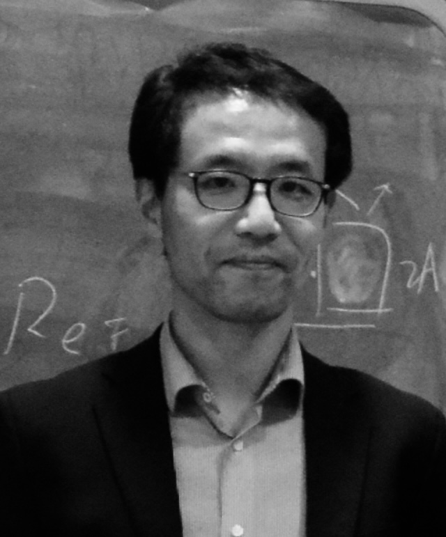

 <!--#Prof. Xiaofeng Guo, Université Paris Cité-->

<!--Professor-->
Université Paris Cité
\
Directeur des études & relations internationales, IUT de Paris Pajol
\
Paris Interdisciplinary Energy Research Institute, LIED-PIERI UMR 8236 CNRS

Contact info:\
Xiaofeng.Guo[at]u-paris.fr\
To come to my lab: 10 Rue Alice Domon et Léonie Duquet, 75013, Paris

> **Latest news**
> > __2024.12.13:__\
> My lab and the GIEC CAS (Guangzhou Institute of Energy Conversion, Chinese Academy of Sciences) has launched an Alliance in Low-carbon energy system research (Alliance SEEDs). I'm honored to be appointed as the French side coordinator. Welcome to join our Alliance. [Report Sciencenet.cn](https://news.sciencenet.cn/htmlnews/2024/12/536100.shtm).  \
> __2024.12:__\
> Submission is open to attent the 4th International Conference on Energy Storage and Saving (ICENSS2025) on 26-28 May 2025. https://icenss2025.sciencesconf.org/.  \
> __2024.11.26:__\
>  Welcome to participate to a Cine-debate over the film FLOW, Rendez-vous on 26 Nov evening at the University (45 rue des Saintes Pères, 75006, Paris)\
> __2024.08:__\
> I am organizing the 4th International Conference on Energy Storage and Saving (ICENSS2025) on 26-28 May 2025. The conference will be hosted by Université Paris Cité (85 Bd Saint Germain, 75006, Paris) [website](https://icenss2025.sciencesconf.org/). More details are coming during the next a few months. Please save the dates!! \
> __2024.05:__\
> I'm co-organizing a round table on Educational resources and climate change the 30th of May, 2024, at Université Paris Cité (rue Saints Pères, 75006) during the upcoming IARTEM conference [link here](https://iartem-17.sciencesconf.org/resource/page/id/10)\
> __2023.09:__\
> I'm excited to be appointed as a chair professor for Circle-U (European University Alliance, co-funded by EU Erasmus+ programme) \
> __2023.05:__\
> I'm giving an invited talk at the Annual seminar LIEPP, Sciences Po Paris. The title is "Energy efficiency in buildings: physical rules and behavioural impacts". \
> __2023.03:__\
> I'm editing a special issue for Biosensors (IF 5.743). The topic is "Acoustic Microfluidic Devices: From Fabrication to Application", [link here](https://www.mdpi.com/journal/biosensors/special_issues/Y37EVF7U1I)\
> If you have relevant manuscripts and wish to publish in this special issue, please let me know. I've several free APC tokens.

## Appointments
- Since 2021: full professor (1st class), Université Paris Cité
- Since 2021: full professor, Université Paris Cité
- Since 2023: chair professor (20%), Circle-U (European University Alliance)
- 2020-21: full-time visiting researcher at CNRS (LIED)
- 2023-2025: guest professor, Wuhan University of Science and Technology
- 2023-2025: guest researcher, Guangzhou Institute of Energy Conversion, Chinese Acadamy of Sciences
- 2024-2026: guest professor, South China Agricultral University, Institute of Biomass Engineering
- 2017-21: associate professor, ESIEE Paris, Université Gustave Eiffel, Course director of Diplôme d'ingénieur in Energie
- Since 2017: permanent researcher in Paris Interdisciplinary Energy Research Institute, LIED UMR 8236, CNRS, Université de Paris (former Paris 7)
- 2014-17: Researcher (40%), EFFICACITY Institute of Energy Transition for Cities (PIA2)
- 2013-16: assistant professor, ESIEE Paris, CCI Paris Ile-de-France

<!---COMMENT
- 
--> 

## Education
- HDR (Habilitation to supervise research), Faculté des Sciences, Université de Paris (2021)
- PhD, Energy and Process Engineering, Université de Grenoble (2013)
- MSc, Refrigeration and Air Conditioning, Shanghai Jiao Tong University (2010)
- BEng, Thermal and Power Engineering, Wuhan University of Technology (2007)

## Graduate students supervisions
- 3 PhD defended (2018, 2020, 2022)
- 1 full PhD supervision, 2024-2027
- 2 PhD supervisions at 50%, for periods of 2020-2024 and 2021-2024
- In average 2 Master interns per year, 6 months each

## Awards and prizes

- Laureate of JTFC (Jeunes Talents France-Chine), MESRI-MEAE, Ambassade de France en Chine, 2018
- Second prize award, TMREES16 Int’l Conf. Fall Meeting, “Technologies and Materials for Renewable Energy, Environment and Sustainability”, November 16-18, 2016, Paris.
- Instructor of ESIEE team Mobiliteam, the top prize (10 k€) winner of a world competition Decarbonathon, initiated by World Young Leaders and organised by ENGIE/NPL, Paris, 2016.
- Best paper award, HEFAT2012, the 9th Int. Conf. on Heat Transfer, Fluid Mechanics and Thermodynamics, Session “Heat and Mass Transfer 6”,  16-18 July 2012, MALTA.
- Team award of innovation, Doctorials, Autrans, France, 2012
- Bursary from Tyco International Fellowship (Johnsons controls), Shanghai Jiao Tong University, 2009
- Bursary for master programme, Shanghai Jiao Tong University, 2007-2010
- Hong Kong Providence Foundation bursary, 2009
- Top Class Scholarship (1 out of 1000), Wuhan University of Technology, 2007
- National Scholarship from the Ministry of Education, China, 2nd class, 2006

## Grants

- CleanPV2Water, Joint call Université Paris Cité and Université Mohammed VI Polytechnique, Co-I, 2024-2026
- Thermal and Indoor Environmental Effects on Student Cognition and Learning Outcomes: A Comparative Study between Tropical and Temperate Climates, Co-PI, joint funding between Université Paris Cité – National University of Singapore, 37,500SGD + 25,000€, 2024-2026
- VibStreamEnhance, PI, IDEX Emergence funding, Université Paris Cité, 39605 €, 2024-2026 
- PajolConnecté - Non-intruisive multiphysics monitoring of the Pajol building on energy and comfort, PI, IdEx Université Paris Cité, 53.3 k€, 2022-2024
- ICCAR - Interfaces Conductrices pour le Chauffage et l’Alimentation des Routes, Co-I, financement
ADEME en partenariat avec Eiffage et Rescoll, 2022-2025
- HiReSoL “High Resolution GIS DH Source-Load Mapping”, resp. for French-side topics, led by KTH and in collaboration with Nottingham Trent University, Energimyndigheten (Swedish Energy Agency), 2021-2024
- CPER Ile de France, Ilot de Fraicheur Urbain, participant, 2020-2021
- SweetCities to RISE, PI, I-SITE FUTURE Mobility funding, in collaboration with KTH Royal Institute of Technology, Stockholm, 2020-2021
- AUE-EU-China “Advanced Urban Energy – an EU-China comparison”, PI, I-SITE FUTURE Mobility funding, in collaboration with Changzhou University, 2019-2021
- SimSenseEnergie, PI, I-SITE FUTURE, in collaboration with IFSTTAR Sense-City, 2020-2022
- Wise Cities 3, Co-I, resp. for bilateral research task “water-energy nexus”, I-SITE FUTURE, 2019-2022
- ZeroCO2 TRIGEN (CCHP with net zero CO2 emission), Co-I, I-SITE FUTURE, in collaboration with IFSTTAR Satory, 2019-2020
- CSC (China Scholarship Council) PhD funding, co-supervisor, candidate Zhuo Ma, 2020-2024, 48 months
- CSC visiting professor, Prof. Zhenlong Fang (Wuhan University of Technology), 2022-2023, 12 months
- CSC PhD funding, supervisor, candidate Geyu Zhong, 2020-2021, 18 months
- CSC PhD funding, supervisor, candidate Xiangshu Lei, 2021-2023, 18 months
- CSC PhD mobility, supervisor, candidate Fan Chen, 2020-2021, 12 months
- CSC full PhD funding, co-supervisor, candidate Chuanyu Zhang, 2017-2020, 36 months
- SATT IDF Innov, FLEXER, patent and maturation, PI, 2018
- PHC Xu Guangqi, Data4EnerBat, French side PI, with Shanghai Jiao Tong University, Ministère de l'Europe et des Affaires étrangères, Campus France, 2018
- EFFICACITY, funding by participative research indemnity, 50 k€, 2014-2016
- CEMIP GIP-CNFM, platform for electronic cooling, 13.5 k€, 2016
- CEMIP FINMINA, platform for microstructural thermal properties characterization, 22 k€, 2015
- EFFICACITY, building energy audit, 10 k€, 2015
- ESIEE Innovation technologique, 3 k€, 2013

## Expertises
- Expert for ISET Jendouba, Ministry of Higher Education and Research, Tunisia, ADIUT, (2023-)
- Evaluation expert for the National Science Centre of Poland (2020)
- Evaluation expert for EPSRC The Engineering and Physical Sciences Research Council of the UK, (2019, 2020)
- Evaluation expert for ANR Agence Nationale de Recherche (2017)

## Referee and editorial services
- Conference chair, ICENSS2025, 4th International Conference on Energy Storage and Saving (ICENSS2025), 26-28 May 2025, Paris
- Editorial Board member, "Energy Storage and Saving" (Elsevier), 2022-
- Co-organizer and facilitator of a round table on Educational resources and climate change, [IARTEM](https://iartem-17.sciencesconf.org/resource/page/id/10) conference, 27-31st of May, 2024, Paris 
- Associate editor, "Research", a CAST & AAAS journal (IF=11, 2022), [link](https://spj.science.org/journal/research), 2023-
- Topic editor for "Biosensors", Special Issue "Acoustic Microfluidic Devices: From Fabrication to Application"
- Corresponding expert, "Engineering" (Elsevier & CAE), 2022-
- Co-organiser, Educational resources and climate change, 17th International IARTEM conference, 28-31 May 2024 Paris 
- Topic editor for "Frontiers in Built Environment", 2022
- Review editor for "Frontiers in Energy Efficiency", since 2022
- Scientific advisory board, HEFAT conferences (since 2021)
- Perpetual member of American Association for the Advancement of Science (AAAS) since 2024
- Session chair, ATE-HEFAT 2021 conference
- Scientific committee member, FUTURE Days 2020, Université Gustave Eiffel
- Coordinator of task group “Energy” in EquipEx SenseCity (PIA2), 2018-2020
- Session chair, the 6th International Conference on Cryogenics and Refrigeration 2018 (ICCR2018), April 12-14, 2018, Shanghai
- Review expert for SFT2019, Nantes
- Member of Société Française de Thermique and Société Française de Génies des Procédés
- Member of China Society of Thermophysics, China Society of HVAC&R
- Member of the editorial board for “Frontiers in Mechanical Engineering”
- Regular referee for Elsevier/ASME/AIP/Taylor & Francis/Frontiers journals including "Micro & Nano Letters", "Physics of Fluids", “Int. J. Heat and Mass Transfer”, “Applied Energy”, “Energy”, “Energy and Buildings”, “Energy Conversion and Management”, “Chemical Engineering Journal”, “Chemical Engineering Science”, “Energy Efficiency”, “Fuel”, “Int. J. Hydrogen Energy”, “ASME J. of Thermal Science and Engineering Applications”, “Frontiers in Built Environment”, “Frontiers in Energy Research”, “Review of Scientific Instruments”, “Journal of Dispersion Science and Technology”.

## PhD Committee
- PhD thesis examiner, IIT Jodhpur (INDIA), 2024
- PhD thesis examiner, IIT Indore (INDIA), 2024
- Rapporteur de thèse, Université de Lille, 02/06/2023 (AHOURE Louis)
- PhD defence examiner (président du jury), Université Gustave Eiffel, 20/11/2022 (BOURDEAU Mathieu)
- PhD defence examiner, Université Gustave Eiffel, 03/02/2022 (GAO Lan)
- PhD defence examiner, Université Gustave Eiffel, 10/12/2021 (SARKAR Sreyash)
- PhD defence examiner, Université de Paris, 30/09/2020 (ZHANG Chuanyu)
- PhD defence evaluator, KTH Stockholm, department of Energy, SWEDEN, 17/12/2019 (SU Chang)
- Member of committee, ESYCOM, Université Paris Est, 31/05/2018 (GOUMBA Alain Pascal)

<!--- This is an HTML comment in Markdown 

## Research interests | current projects
- Acoustic Streaming in mini/microfluidics (in collaboration with MSC lab)
- Thermal energy storage by Phase Change Materials (PCM)
- Bigdata and physics based modelling in service of BEM/BIM
- Thermal stratification in hot water tank
- Dynamic simulation of Heat Pumps in service of Domestic Hot Water (DHW) and Heating supply in urban context
-->

## Pedagogical achievements

- Coordinator of Engineer diploma in ESIEE Paris for the specialty Energy (3 years teaching program, responsible for 10+ courses, confirmed success with number of students from 20 to 49 per promotion from 2014 to 2020)
- Teaching Ingénieur (Engineer, eq. L3 to M2) level courses since 2013: Heat transfer (30h), Thermodynamics (14h), Solar thermal engineering (30h), Numerical methods applied to energy (30h), Computational fluid dynamics by ANSYS (30h), Dynamic simulation by TRNSYS (30h)
- Engineering courses in other universities include: “Energy Audit and Energy Efficiency in Buildings” at IMT Lille Douai (2019); “Water-Energy nexus” at Ecole des Ponts (ENPC, 2020).

## Visiting professors 
- Gustav Graeber, Humboldt-Universität zu Berlin, Germany (2026)
- Aloys Osano, Maasai Mara University, Kenya (2026)
- Feng Qian, Wuhan University of Sciences and Technology, China (2025)
- Xueyong WEI, Xi'an Jiaotong University (2025)
- Paulo DE SOUSA FILHO, University of Campinas (UNICAMP)
- Zhenlong FANG, Wuhan University of Technology, China (2022/23)
- Hatef MADANI, KTH Royal Institute of Technology, Sweden (2018)
- Cheng WANG, Changzhou University, China (2019)

## Former students
- Xiangshu LEI, PhD, 2023
- Geyu ZHONG, PhD, 2022
- Mohamed CHERDOUH, intern, 2022
- Chuanyu ZHANG, PhD (CSC funding), defended 2020/09, (postdoc at Université Gustave Eiffel - IFSTTAR), 2017-2020
- Sixiang LYU, Master thesis intern, 2019
- Mathieu BOURDEAU, collaborative project exchange (University of Paris Est and Shanghai Jiao Tong University), 2017-2018
- Alain Pascal GOUMBA, PhD, defended 2018/05 (Research Engineer in Efficacity)
- Matheus DE OLIVEIRA VILELA, Master, 2016
- Soufiane ACOUDAD, Engineer, 2015
- Arinaly RALAHY, Engineer, 2015

## Publications (full list with pdf access see [Publications](publications))
[Google Scholar](https://scholar.google.com/citations?user=_5niNDcAAAAJ&hl=en)
\
[ORCID](https://orcid.org/my-orcid?orcid=0000-0001-5306-1219)

